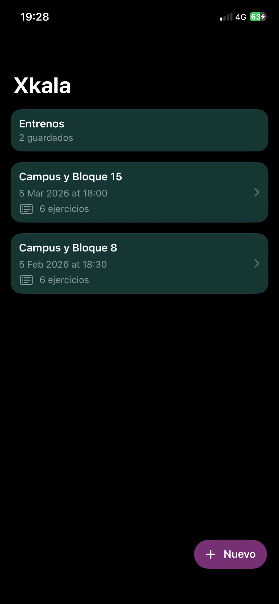
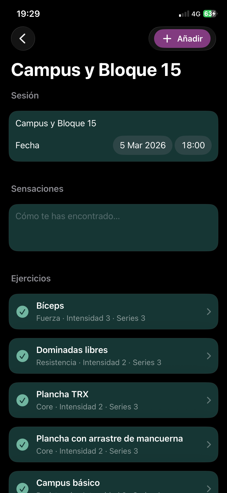
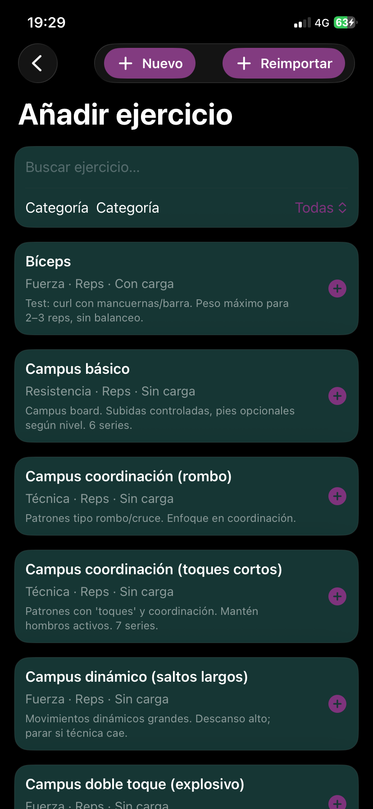
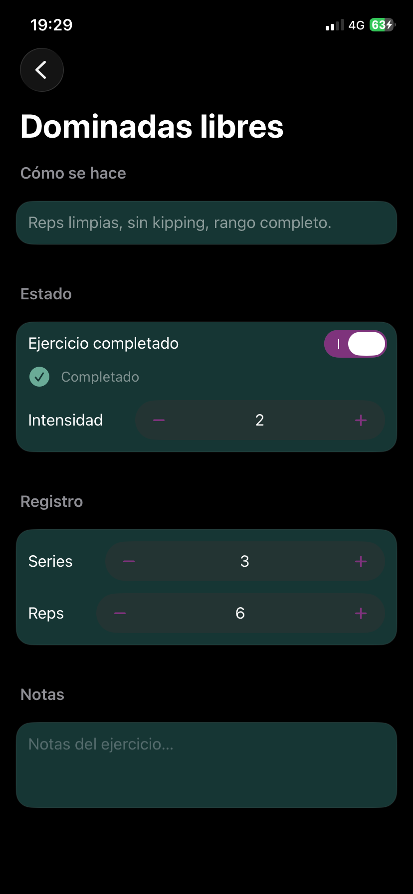

# Xkala

App iOS para registrar entrenamientos de escalada.

Desarrollada con **SwiftUI** y **SwiftData**, Xkala permite registrar sesiones de entrenamiento, ejercicios y series de forma rápida durante el entrenamiento.

Actualmente es un proyecto personal para validar el uso real de la app durante sesiones de escalada.

  
  
  
  

## Funcionalidades

- creación de un entrenamiento por día
- catálogo de ejercicios
- ejercicios por **repeticiones** o **tiempo**
- registro de **series**, **intensidad** y **notas**
- soporte opcional para **carga (kg)**
- persistencia local con **SwiftData**

## Modelo de datos

La app se basa en cuatro entidades principales:

- **WorkoutDay** — sesión de entrenamiento
- **Exercise** — definición del ejercicio
- **WorkoutEntry** — ejercicio dentro de un entrenamiento
- **SetRecord** — datos de cada serie

Relación simplificada:

WorkoutDay
└── WorkoutEntry
└── SetRecord

Exercise
└── WorkoutEntry

## Tecnologías

- SwiftUI
- SwiftData
- iOS

## Estado del proyecto

Versión actual: **v0.1.0**

Primera versión funcional ejecutándose en dispositivo real.

## Autor

Ben16
